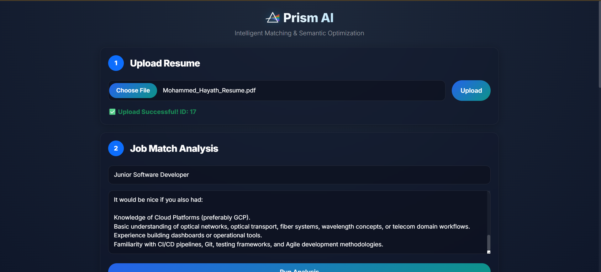
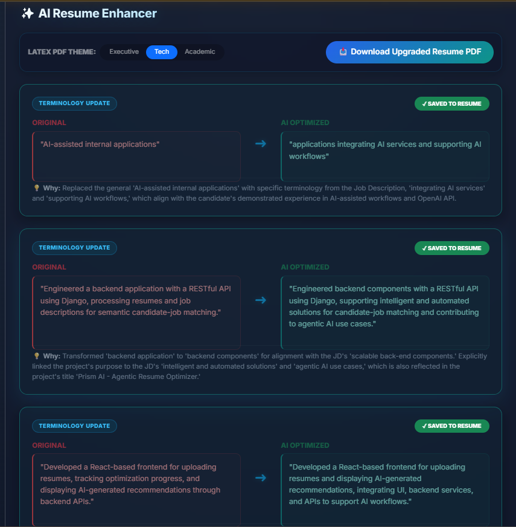
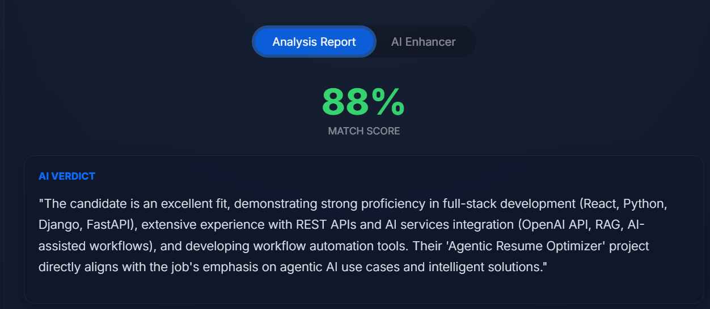

# 💎 Prism AI (formerly Resume Analyzer)

### *Intelligent Career Alignment Agent*

A Semantic AI Agent that doesn't just "read" resumes—it **optimizes** them.
Using **Google Gemini 2.5 Flash**, **Vector Embeddings (RAG)**, and **Agentic Workflows**, Prism AI analyzes your resume against a target JD and **rewrites your bullet points** to match the industry terminology of the company.

---

### ✨ New "Liquid Glass" Dashboard



---

## 🌟 Key Features

### 🧠 1. Semantic Analysis Agent
* **Beyond Keywords:** Uses Vector Search (ChromaDB) to understand the *meaning* of your skills, not just exact text matches.
* **Deep Reasoning:** The AI provides a "Verdict" explaining *why* you are (or aren't) a good fit.

### ⚡ 2. Dynamic "Optimizer" Agent
* **Active Rewriting:** It doesn't just give feedback; it **rewrites your resume** for you.
* **Hybrid Matching Engine:** Uses a surgical, case-insensitive substring matching algorithm to replace specific sentences within bullet points, falling back to a sequence fuzzy-matcher (80%+ ratio) to guarantee replacements always apply cleanly.
* **State Persistence:** Rejection/acceptance status of suggestions is permanently synchronized with the backend, preserving states seamlessly across browser refreshes and tab navigations.
* **Side-by-Side Diff:** See the "Original" vs. "AI Optimized" version in a clean comparison view.



### 📄 3. Premium LaTeX PDF Generation & Export
* **Theme Customization:** Seamlessly render and export your newly compiled, optimized resume using professional, standard-compliant LaTeX templates.
* **Three Curated Themes:** Select from **Executive** (compact for management), **Tech** (modern spacing with bold accents for engineers), or **Academic** (classic spacing for education).
* **Automated Local Compilations:** The backend automatically generates clean, escape-safe `.tex` files, runs `pdflatex` in secure isolated sandboxes, and streams the finished binary PDF directly to your device downloads.

### 🎨 4. Modern "Liquid Glass" UI
* **Glassmorphism Design:** Features a mesh-gradient background with frosted glass cards.
* **Interactive Elements:** Smooth transitions, dynamic badges, and a "Dark Mode" native aesthetic.
* **State Restoration:** Automatically checks for and restores existing matching/suggestion states on component load to avoid redundant background AI calls.

---

## 📂 Project Organization & Decoupled Storage
To maintain a clean working directory, the storage for candidate uploads has been cleanly decoupled from development build environments:
* **`resumes/`**: Django storage folder containing candidate's uploaded original files (PDF/DOCX).
* **`generated_resumes/`**: Dedicated subfolder for LaTeX-compiled outputs.
  * Successful builds: Generates the LaTeX source `generated_resume_10.tex`, compiled binary `generated_resume_10.pdf`, and compiler stdout logs `generated_resume_10.log`.
  * Debug builds: Compilation failures generate `failed_resume.tex` and `failed_resume.log` inside this directory for easy developer troubleshooting.


---

## 🚀 Quick Start (Docker Compose)

You can run the entire decoupled stack (Frontend, Backend, Celery Worker, Redis, and SQLite) instantly with one command:

### 1. Configure your `.env` file:
Create a `.env` file in the root of the project directory:
```ini
USE_VERTEX_AI=True
GCP_PROJECT_ID="your-gcp-project-id"
GCP_LOCATION="us-central1"
GEMINI_MODEL="gemini-2.5-flash"
```

### 2. Launch the services:
```bash
docker-compose up -d --build
```

### 3. Initialize the SQLite database:
```bash
docker-compose exec backend python3 manage.py migrate
```

* **Frontend Dashboard**: `http://localhost` (Port 80)
* **Backend API Docs**: `http://localhost:8000/api/`

---

## 🛠️ GCP Production Deployment Checklist

When deploying this agent on a Google Cloud Platform Compute Engine Virtual Machine (GCE VM), refer to this checklist to ensure smooth, secure operations:

1. 🔑 **Access Scopes (Vertex AI Authorization):** 
   Set the VM Instance API Access Scope to **"Allow full access to all Cloud APIs"** (`cloud-platform`). This allows Python's Google Cloud SDK to automatically and securely authenticate with Vertex AI without needing hardcoded Service Account JSON keys.
2. 🛜 **VPC Firewall Configuration:** 
   Add a public ingress firewall rule allowing **`tcp:80`** from IP ranges `0.0.0.0/0` so the React/Nginx frontend is accessible on the open web.
3. ⚙️ **Celery Solo Pool for gRPC:** 
   To prevent Google Cloud client libraries (which use gRPC) from hanging due to fork-safety issues, always run the Celery worker with the `--pool=solo` flag:
   ```bash
   celery -A AI_Agent_Powered_Resume_Analyzer worker --loglevel=info --pool=solo
   ```
4. 💾 **Docker Space Pruning:** 
   LaTeX compilation dependencies (`texlive-latex-extra`) require about 1.5GB of space during Docker builds. Clean up dangling images using `docker system prune -a --volumes -f` to maintain sufficient free disk space.
5. 🛡️ **Django ALLOWED_HOSTS:** 
   In production, configure `ALLOWED_HOSTS = ['*']` in `settings.py` so Django accepts requests routed through the public VM IP address or load balancers.
---

## 🛠️ Tech Stack

* **Brain:** Google Gemini 2.5 Flash & Vertex AI (via Unified Google Gen AI SDK)
* **Memory:** ChromaDB (Vector Store for RAG)
* **Backend:** Django REST Framework (Python)
* **Frontend:** React.js + Custom "Liquid Glass" CSS
* **Orchestration:** Celery + Redis (Asynchronous Agent Queues)

---

## 🚀 How to Run

### Prerequisites
* Python 3.10+
* Node.js
* Redis Server (Running locally)
* Google Gemini API Key (AI Studio) or Google Cloud Platform Credentials (Vertex AI)
* **LaTeX Compiler (Required for PDF Generation & Download):**
  * **Windows:** Download and install [MiKTeX](https://miktex.org/download). Ensure `pdflatex` is added to your system environment variable `PATH`.
  * **macOS:** Install MacTeX (without GUI) using Homebrew: `brew install --cask mactex-no-gui`
  * **Linux (Debian/Ubuntu):** Install base TeX Live packages: `sudo apt-get update && sudo apt-get install -y texlive-latex-base texlive-latex-extra texlive-fonts-recommended`

### 1. Backend Setup

```bash
# Enter project directory
cd Prism-AI

# Virtual Env
python -m venv .venv
# Activate on Windows:
.venv\Scripts\activate
# Activate on macOS/Linux:
source .venv/bin/activate

# Install Dependencies
pip install -r requirements.txt
```

#### Setup Environment Variables (Create a `.env` file in the root directory):
```env
# Switch between Google AI Studio (False) or Google Cloud Vertex AI (True)
USE_VERTEX_AI=False

# If using AI Studio:
GEMINI_API_KEY="your_ai_studio_api_key"

# If using Vertex AI (USE_VERTEX_AI=True):
GCP_PROJECT_ID="your_gcp_project_id"
GCP_LOCATION="us-central1"

# Target Model Specification
GEMINI_MODEL="gemini-2.5-flash"
```

```bash
# Migrations
python manage.py migrate

# Start Redis Worker (Terminal 1)
# NOTE: The --pool=solo flag is required on Windows to avoid Celery multiprocessing issues
celery -A AI_Agent_Powered_Resume_Analyzer worker --loglevel=info --pool=solo

# Start Django Server (Terminal 2)
python manage.py runserver
```

### 2. Frontend Setup

```bash
cd resume-ai-frontend

# Install Node Modules
npm install

# Start React App
npm start
```
The React development server will start at `http://localhost:3000`.

---

## 📸 Screen Gallery

**1. The "Liquid Glass" Dashboard**
*A modern, dark-themed upload interface using glassmorphism design.*


**2. The Analysis Report**
*Deep semantic analysis of the resume vs. the job description with a fitment score.*


**3. The AI Optimizer**
*Side-by-side comparison showing how the AI rewrites bullet points to match the JD.*


---

## 🔮 Future Roadmap

* [ ] **Interview Agent:** Generates tech-stack specific questions based on the gaps found.
* [ ] **PDF Export:** Fully integrated button to download the "Optimized Resume" as compiled directly from the frontend themes.
* [ ] **LinkedIn Scraper:** Auto-fetch JDs from LinkedIn URLs.

---

**Star ⭐ this repo if you like it!**
